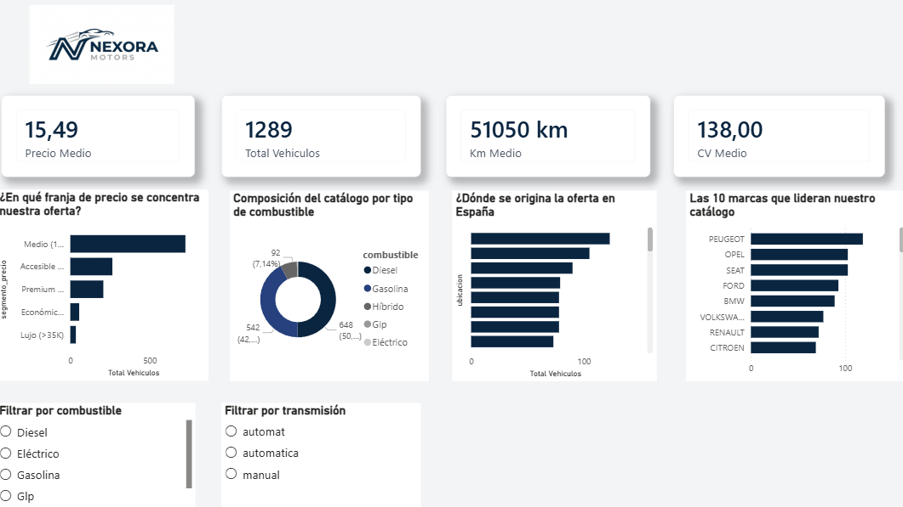
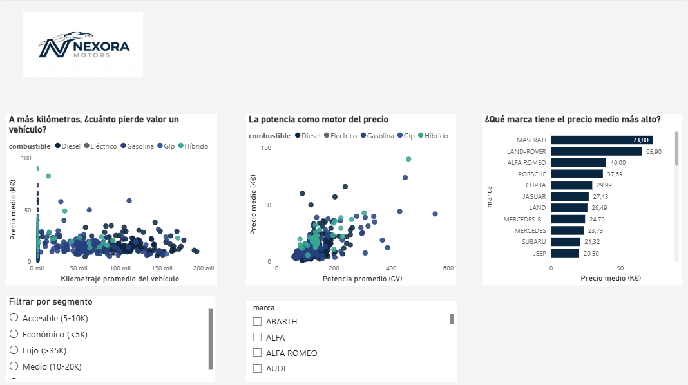
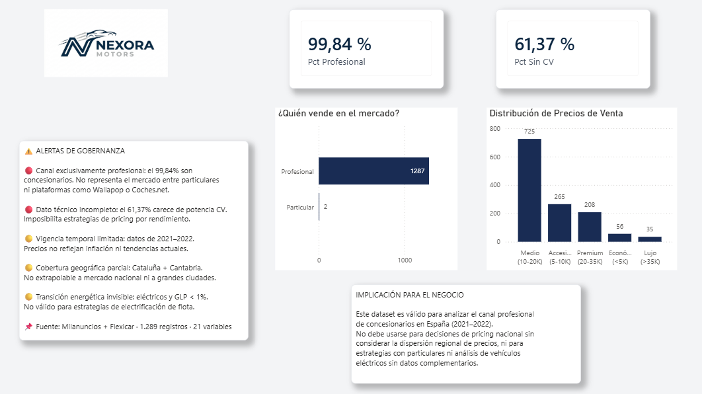

<p align="center">
  
</p>

<h1 align="center">Nexora Motors — Market Analytics Dashboard</h1>

<p align="center">
  <strong>Inteligencia de negocio para el mercado de vehículos de segunda mano en España</strong>
</p>

<p align="center">
  
  
  
  
  
</p>

---

## Índice

1. [Contexto ejecutivo](#1-contexto-ejecutivo)
2. [Problema de negocio](#2-problema-de-negocio)
3. [Solución desplegada](#3-solución-desplegada)
4. [Dataset](#4-dataset)
5. [Arquitectura del dashboard](#5-arquitectura-del-dashboard)
6. [Lógica de negocio — Medidas DAX](#6-lógica-de-negocio--medidas-dax)
7. [Gobernanza y sesgos](#7-gobernanza-y-sesgos)
8. [Recomendaciones estratégicas](#8-recomendaciones-estratégicas)
9. [Estructura del repositorio](#9-estructura-del-repositorio)
10. [Despliegue](#10-despliegue)
11. [Autora](#11-autora)

---

## 1. Contexto ejecutivo

**Nexora Motors** es una plataforma digital de compraventa de vehículos de segunda mano que opera en el mercado español. En un sector donde se comercializan más de **2,1 millones de unidades anuales** — el doble que coches nuevos — la capacidad de tomar decisiones basadas en datos no es una ventaja competitiva: es una necesidad operativa.

Hasta la fecha, los mandos intermedios y el comité directivo recibían informes tabulares estáticos sin posibilidad de exploración dinámica. Esto ralentizaba la identificación de patrones de mercado, anomalías de precio y oportunidades de posicionamiento.

Este proyecto responde a ese déficit con una solución de inteligencia de negocio de nivel empresarial.

---

## 2. Problema de negocio

El análisis parte de cuatro preguntas estratégicas sin respuesta en la organización:

| # | Pregunta estratégica |
|---|---|
| 1 | ¿Qué narrativa de alto valor ocultan los datos actuales del catálogo? |
| 2 | ¿Cómo puede un directivo explorar métricas y simular escenarios sin tocar código? |
| 3 | ¿Qué sesgos latentes en los datos podrían generar decisiones erróneas con impacto financiero? |
| 4 | ¿Qué acciones operativas concretas se derivan del histórico de datos disponible? |

---

## 3. Solución desplegada

Un **cuadro de mando ejecutivo interactivo** construido en Power BI Desktop con tres páginas analíticas interconectadas, medidas DAX documentadas y una sección explícita de gobernanza de datos.

La herramienta permite a cualquier perfil directivo — sin formación técnica — explorar el mercado, aplicar filtros cruzados en tiempo real y extraer conclusiones estratégicas accionables.

**Herramienta seleccionada: Power BI Desktop**

Elegida por tres razones:
- Licencia gratuita con despliegue en Power BI Service para acceso remoto
- Interactividad cruzada nativa entre todos los componentes visuales
- Motor de cálculo DAX para medidas de negocio precisas y auditables

---

## 4. Dataset

### Origen y fusión

| Fuente | Plataforma | Cobertura |
|---|---|---|
| Milanuncios | Portal de anuncios de segunda mano | Nacional — España |
| Flexicar España | Red de concesionarios profesionales | Nacional — España |

### Características del dataset fusionado

| Parámetro | Valor |
|---|---|
| Archivo final | `coches_clean.csv` |
| Total de registros | **1.289 vehículos** |
| Total de variables | **21 columnas** |
| Variables numéricas | `precio`, `km`, `cv`, `antigüedad`, `engagement_score`, `precio_por_cv` |
| Variables categóricas | `marca`, `modelo`, `combustible`, `transmisión`, `ubicación`, `particular`, `segmento_precio`, `rango_antigüedad` |

### Proceso de limpieza y transformación

```
1. Carga y fusión de los dos datasets fuente mediante Python (Pandas)
2. Inspección de dimensiones, tipos de columna y valores nulos
3. Eliminación de duplicados exactos
4. Imputación o exclusión justificada de valores nulos por variable
5. Normalización de categorías (marcas, combustibles, transmisiones)
6. Creación de columnas derivadas: segmento_precio, rango_antigüedad, precio_por_cv
7. Exportación del dataset limpio como coches_clean.csv
8. Carga en Power BI y modelado de datos
```

---

## 5. Arquitectura del dashboard

### Página 1 — Visión General del Mercado

Responde a: *¿Cómo está estructurado el catálogo de Nexora Motors?*

| Componente | Tipo | Métrica |
|---|---|---|
| KPI Precio Medio | Tarjeta | `15.490 €` |
| KPI Total Vehículos | Tarjeta | `1.289` |
| KPI Km Medio | Tarjeta | `51.050 km` |
| KPI CV Medio | Tarjeta | `138 CV` |
| Segmentos de precio | Barras horizontales | Distribución por `segmento_precio` |
| Combustible | Gráfico de anillo | Composición por tipo |
| Origen geográfico | Barras | Vehículos por `ubicación` |
| Top 10 marcas | Barras horizontales | Volumen por `marca` |
| Filtro combustible | Segmentador | Diésel · Eléctrico · Gasolina · GLP · Híbrido |
| Filtro transmisión | Segmentador | Manual · Automático |

---

### Página 2 — Análisis de Precio

Responde a: *¿Qué variables determinan el precio de un vehículo usado?*

| Componente | Tipo | Insight clave |
|---|---|---|
| Km vs Precio | Dispersión por combustible | A más km, menor precio |
| CV vs Precio | Dispersión por combustible | A más potencia, mayor precio |
| Ranking por precio medio | Barras horizontales | Maserati lidera con 73.800 € |
| Filtro segmento | Segmentador | Económico · Accesible · Medio · Premium · Lujo |
| Filtro marca | Segmentador múltiple | Selección por marca individual |

---

### Página 3 — Gobernanza y Sesgos

Responde a: *¿En qué no debemos confiar de nuestros propios datos?*

| Componente | Tipo | Valor |
|---|---|---|
| KPI Vendedores Profesionales | Tarjeta | `99,84 %` |
| KPI Vehículos Sin Potencia CV | Tarjeta | `61,37 %` |
| Canal de venta | Barras horizontales | Profesional (1.287) vs Particular (2) |
| Distribución de precios | Histograma | Por `segmento_precio` |
| Alertas de gobernanza | Cuadro de texto | 5 sesgos documentados |
| Implicación para el negocio | Cuadro de texto | Límites de uso del dataset |

---

## 6. Lógica de negocio — Medidas DAX

Todas las medidas están documentadas para garantizar la auditabilidad y reproducibilidad del análisis.

```dax
-- ── MEDIDA 1 ──────────────────────────────────────────
-- Porcentaje de vendedores profesionales
Pct Profesional =
DIVIDE(
    COUNTROWS(FILTER(coches_clean, coches_clean[particular] = "no")),
    COUNTROWS(coches_clean)
) * 100

-- ── MEDIDA 2 ──────────────────────────────────────────
-- Porcentaje de vehículos sin dato de potencia
Pct Sin CV =
DIVIDE(
    COUNTROWS(FILTER(coches_clean, ISBLANK(coches_clean[cv]))),
    COUNTROWS(coches_clean)
) * 100

-- ── MEDIDA 3 ──────────────────────────────────────────
-- Precio medio del catálogo
Precio Medio = AVERAGE(coches_clean[precio])

-- ── MEDIDA 4 ──────────────────────────────────────────
-- Kilometraje medio
Km Medio = AVERAGE(coches_clean[km])

-- ── MEDIDA 5 ──────────────────────────────────────────
-- Potencia media en CV
CV Medio = AVERAGE(coches_clean[cv])

-- ── COLUMNA CALCULADA 1 ───────────────────────────────
-- Segmento de precio
Segmento_Precio =
SWITCH(
    TRUE(),
    coches_clean[precio] < 5000,  "Económico (<5K)",
    coches_clean[precio] < 10000, "Accesible (5-10K)",
    coches_clean[precio] < 20000, "Medio (10-20K)",
    coches_clean[precio] < 35000, "Premium (20-35K)",
    "Lujo (>35K)"
)
```

---

## 7. Gobernanza y sesgos

La identificación explícita de sesgos es el núcleo ético del proyecto. Ignorarlos generaría decisiones empresariales con impacto financiero y reputacional directo.

### Sesgos identificados

| Nivel | Sesgo | Impacto si se ignora |
|---|---|---|
| 🔴 Crítico | **Canal profesional** — 99,84% concesionarios | Estrategias dirigidas a particulares basadas en datos que no los representan |
| 🔴 Crítico | **Potencia incompleta** — 61,37% sin CV | Pricing por rendimiento ciego; pérdida de margen por segmentación incorrecta |
| 🟡 Moderado | **Vigencia temporal** — datos 2021–2022 | Referencias de precio desfasadas hasta un 30% respecto al mercado actual |
| 🟡 Moderado | **Dispersión regional** — precios varían >100% entre provincias | Pricing nacional uniforme con pérdidas en mercados de alto valor |
| 🟡 Moderado | **Eléctricos infrarrepresentados** — <1% del dataset | Ausencia de estrategia en el segmento de mayor crecimiento (+54% anual en 2024) |

---

## 8. Recomendaciones estratégicas

Derivadas directamente del análisis visual del dashboard:

**① Apostar por el segmento renting 0–5 años**
Los vehículos jóvenes de flotas de renting crecieron un 25,7% en España en 2024. Mayor margen por unidad, mayor rotación de inventario y menor riesgo de posventa.

**② Capturar la potencia CV en el 100% del inventario**
El 61,37% de los vehículos carece de este dato. Sin él, es imposible construir un modelo de pricing por rendimiento. Cada vehículo sin CV registrado es una oportunidad de margen no capturada.

**③ Actualizar el dataset anualmente**
Los datos de 2021–2022 reflejan un mercado post-pandemia atípico con precios inflados por escasez. El precio medio actual en España es de 20.372€ — un 31% superior al precio medio del dataset. Las decisiones deben basarse en datos vigentes.

---

## 9. Estructura del repositorio

```
nexoramotors-market-analytics/
│
├── 📊 nexora_dashboard.pbix                        # Cuadro de mando Power BI
├── 📁 notebooks/
└── └──01_limpieza.ipynb
└── └──02_analisis.ipynb
│   └── fusion_limpieza.py                           # Proceso ETL documentado en Python
├── 📁 img_logo/
│   └── LogofondoBlancoNexora_Motors.png             # Identidad corporativa
├── 📁 data/
│   ├── coches_clean.csv                             # Dataset final limpio — 1.289 registros
│   ├── coches_fusionado.csv                         # Dataset fusionado intermedio
│   ├── coches_milanuncios_09_04_2021.csv            # Fuente original — Milanuncios
│   └── used_cars_data.csv                           # Fuente original — Flexicar España
├── 📄 .gitignore
└── 📄 README.md                                    # Documentación técnica y de negocio
```

---

## 10. Vista previa del Dashboard

### Página 1 — Visión General


### Página 2 — Análisis de Precio


### Página 3 — Gobernanza y Sesgos


> Dashboard desarrollado en Power BI Desktop.
> Para acceso interactivo, descarga el archivo
> `nexora_dashboard.pbix` e ábrelo en Power BI Desktop
> (descarga gratuita en microsoft.com/powerbi).
---

## 11. Autora

**María Isabel Durango Pérez**
Consultora de Datos e Inteligencia Artificial

Módulo II — Análisis y Visualización de Datos
Proyecto II — Dashboard Interactivo y Storytelling con Datos
Bootcamp de Inteligencia Artificial

---

<p align="center">
  
  <br/>
  <sub>© 2024 Nexora Motors Market Analytics — Proyecto académico individual</sub>
</p>